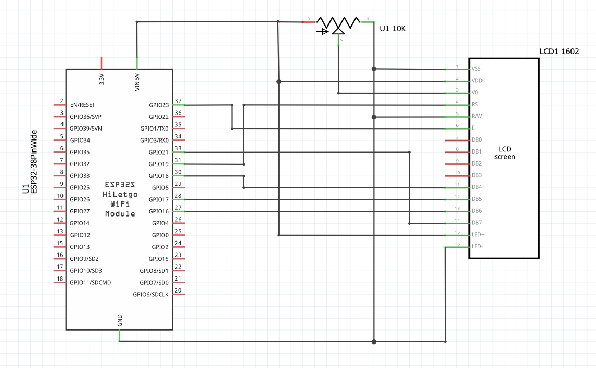

# LCD 1602 interface for ESP32

Interface that allows to use LCD 1620 with ESP32 microcontroller in 4bit mode.

## Installation

Copy ***main*** folder to ***components*** folder of your ESP32 project and rename it to **LCDInterface**.
Add following line to top-level *CMakeLists.txt* file right after *cmake_minimum_required(VERSION 3.5)*


 ```cmake
 list(APPEND EXTRA_COMPONENT_DIRS "components/LCDInterface")
 ```
 Add requirement to main components *CMakeLists.txt* so it looks like this
 ```cmake
 idf_component_register(
    SRCS "main.c"
    INCLUDE_DIRS "."
    REQUIRES LCDInterface
)
```

## Usage
```c
#include <stdio.h>
#include <LCDinterface.h>

void app_main(void) {
	int8_t pins[6] = {23,19,18,17,16,21}; //Used pins [E,RS,D4,D5,D6,D7]
	setupLCD(pins);
    
    write_word("Hello World!");
	/* Prints "Hello World!" on LCD */
}
```

## Circuit 
Pins set to [E=23, RS=19, D4=18, D5=17, D6=16, D7=21]


